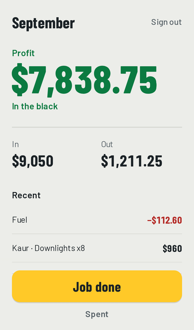
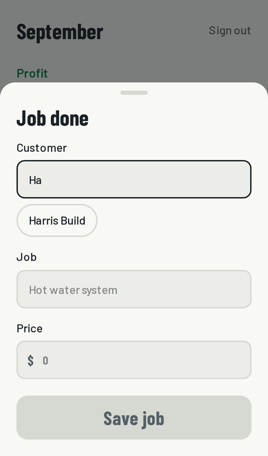
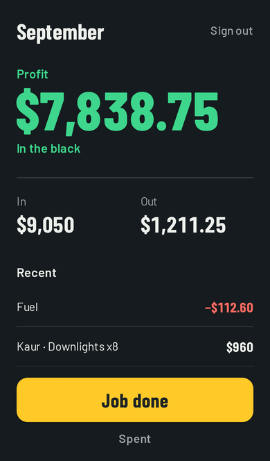

# One Login

**Live: https://simple-tau-gold.vercel.app**

One login, one screen: this month's money in, money out, and what you kept. Built for Australian
tradies who check their numbers on a phone, outside, between jobs. Finish a job, tap **Job done**,
type who, what and how much, and the profit updates before your thumb leaves the glass.

## How to use it

Tap **Try it now**, then **Job done**.

<p>
  
  
  
  
</p>

## What I left out, and why

- **GST and tax breakdown.** One number a tradie trusts beats three they have to think about.
- **Charts and history.** "How's this month going?" is the only question this screen answers.
- **Expense categories and tags.** Nobody sorts receipts at the ute. What-for plus amount is enough.
- **Editing entries.** Delete and re-add, with Undo, covers it without a second form.
- **Settings, profile, onboarding, a menu.** The only thing to do besides log money is sign out.
- **Invoices, quotes, a customers page.** They belong in the full product, not on this screen.
- **Offline queue and realtime multi-device sync.** If you're offline it says so plainly instead of
  pretending it saved.
- **Password reset and email confirmation.** Out of scope for a test build (see Auth below).

## Decisions

- **Cents as integers.** Every amount is an `integer` of cents in Postgres and in TypeScript.
  `lib/money.ts` is the only place that turns "850.50" into 85050 and back.
- **The month is Sydney's month.** Month boundaries are computed in Postgres in
  `Australia/Sydney`, not UTC, so a job at 8am on the 1st lands in the right month
  (`month_start`, `month_entries`, `month_totals` in `supabase/migrations`).
- **Anonymous demo.** "Try it now" signs in anonymously and seeds a realistic month (`seed_demo`),
  so the reviewer sees a real screen in about a second. Email sign-in is one form that signs in
  or creates the account.
- **Optimistic UI.** `useOptimistic` updates totals and the list the moment Save is tapped. The
  server action runs behind it; if it fails, the screen rolls back and says why.
- **Undo instead of confirm dialogs.** Every save and delete shows a 5 second Undo. The client
  picks each entry's UUID, so Undo can find the row without waiting for the server.
- **Row level security does the access control.** Every query runs as the signed-in user; the
  policies only allow reading, adding and deleting your own rows. There is no update policy.
- **Server-only Supabase.** All Supabase calls happen in Server Components, Server Actions and
  `proxy.ts`, so there's no browser client and no `NEXT_PUBLIC_` env vars.
- **Next.js 16.** `middleware.ts` is now `proxy.ts`; it refreshes the session and keeps
  signed-out visitors on `/login`.
- **Few dependencies.** Next.js, React, Tailwind, `@supabase/ssr`, zod. The bottom sheet is a
  native `<dialog>`, the count-up is `requestAnimationFrame`, suggestions are plain buttons.

## Stack

Next.js 16 (App Router, Server Actions) · Supabase (Auth + Postgres) · Tailwind CSS 4 ·
Playwright · Vercel

## Local setup

```bash
git clone <repo> && cd one-login
npm install
cp .env.example .env.local   # fill in SUPABASE_URL and SUPABASE_PUBLISHABLE_KEY
npx supabase link --project-ref <your-project-ref>
npx supabase db push         # applies supabase/migrations
npm run dev
```

In the Supabase dashboard (Authentication → Sign In / Providers):

- Turn on **Anonymous sign-ins** (powers Try it now).
- Keep **Email** on and turn **Confirm email** off for the test build.
- Anonymous sign-ins are rate limited per IP (30/hour by default, under Rate Limits), which
  stops the demo being abused. Turn on CAPTCHA protection if it ever is.
- Set the **Site URL** and redirect URLs to the deployed domain.

For Vercel, set the same two env vars: `SUPABASE_URL`, `SUPABASE_PUBLISHABLE_KEY`.
`vercel.json` pins functions to `bom1` (Mumbai), next to the database in `ap-south-1`; move both
to Sydney (`syd1` / `ap-southeast-2`) for Australian users.

Supabase sees every sign-in coming from Vercel's servers, so the anonymous rate limit is shared by
everyone using the demo, not per visitor.

## Tests

```bash
npm run test:unit   # lib/money.ts parsing and formatting (node:test, no browser)
npm run test:e2e    # Playwright, iPhone 14 viewport, against the Supabase project in .env.local
```

The end-to-end suite covers Try it now, adding a job, Undo, going into the red, delete and Undo,
customer suggestions, price validation, a signed-out redirect, and that one user can't see
another's entries. It runs against a production build (`next build && next start`), or against a
deployment with `BASE_URL=https://simple-tau-gold.vercel.app npm run test:e2e` (all 9 pass).

Lighthouse, mobile, on the live site (performance / accessibility / best practices):
login 98 / 100 / 100, money screen 96 / 100 / 100.

Each run signs in 11 anonymous users. Supabase allows 30 anonymous sign-ins per hour per IP by
default, so a third run inside an hour fails with "Too many tries" (the app's rate-limit message).
Raise the limit under Authentication → Rate Limits while testing if you need to.
